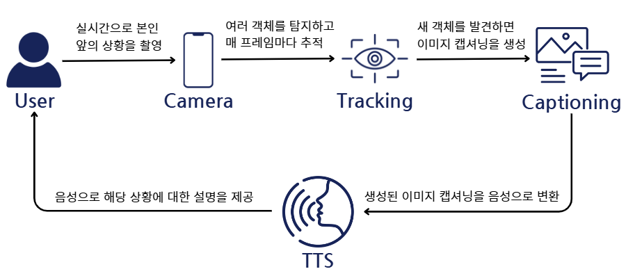

<div align="center">
  <br>
  <picture>
    <source srcset="./assets/readme_logo.png" media="(prefers-color-scheme: dark)">
    
  </picture>
  
  <h2>보이지 않는 세상, 당신의 눈이 되어드리겠습니다.</h2></hr>

</div>
<br>

## 프로젝트 설명

<strong>S.A.V.E</strong>는 👀눈앞의 상황을 🗣️음성으로 설명해주는 서비스입니다.   
사용자 앞에 나타나는 다양한 객체에 대해 탐지하고, 프레임에 새로운 객체가 탐지되면 상황을 음성으로 설명해줍니다.

<div align="center">


</div>

## 시연 영상

https://github.com/user-attachments/assets/0264e4d9-6ad8-4c66-8b4c-e4b619538f37

## 프로젝트 아키텍쳐

### User Flow


### 모델 아키텍쳐


### 서비스 아키텍쳐


## Tech Stack
<p align="left">
    <strong>Language</strong><br>
    
    <br><strong>Client</strong><br>
    
    
    
    <br><strong>API Serving</strong><br>
    
    
    <br><strong>Data & AI Modeling</strong><br>
    
    
    
    
    
    
    
    
    
    
    <br><strong>Development Tools</strong><br>
    
    
    
    
    <br><strong>Tools</strong><br>
    
    
    
    <br><strong>Hardware/Server</strong><br>
    
    
    </p>

## 구성원 및 역할

| |  ||  |
| :-------------------------------------: | :-----------------------------------------: | :-------------------------------------------: | :---------------------------------: | 
|  [박성재](https://github.com/SeongjaeP)   |   [백승제](https://github.com/bsj0530)    |    [이승준](https://github.com/llseungjun)    | [추희정](https://github.com/heejungdev00)  |  
|<p align="center">**Modeling**<br><br>YOLO<br>Clip <br>ClipCap</p> |<p align="center">**Frontend**<br>kivy<br> <br>**Modeling**<br>YOLO</p>| **Project Manager** |<p align="center">**Backend**<br>FastAPI<br><br>**Modeling**<br>YOLO</p> |


## Further Reading
- [발표 자료](<./assets/final_pt.pdf>)


## Ground Rule
### 1. 일반 지침
- 커밋 메시지는 간결하지만 설명적이어야 합니다.
- 명령형을 사용합니다(예: "추가", "수정", "업데이트").
- 제목은 50자로 제한합니다.
- **제목과 본문은 빈 줄로 구분합니다.**
- 본문은 72자로 감싸도록 합니다.

### 2. 커밋 메시지 구조
- **헤더**: 변경 사항에 대한 짧은 요약입니다.
- **본문** (선택 사항): 변경 이유와 관련 정보를 자세히 설명합니다.
- **푸터** (선택 사항): 이슈나 풀 리퀘스트를 참조합니다.

#### 커밋 메세지 작성 예시

```
feat: 사용자 인증 추가 
[Enter]
JWT 토큰을 사용하여 사용자 인증을 구현하였습니다. 이를 통해 사용자가 안전하게 로그인하고 보호된 경로에 접근할 수 있습니다.
[Enter]
Fixes #123
```

### 3. 커밋 유형
- **feat**: 새로운 기능
- **fix**: 버그 수정
- **docs**: 문서만 변경
- **style**: 코드 의미에 영향을 주지 않는 변경(공백, 포맷팅 등)
- **refactor**: 버그 수정이나 기능 추가가 아닌 코드 변경
- **perf**: 성능을 개선하는 코드 변경
- **test**: 누락된 테스트를 추가하거나 기존 테스트 수정
- **chore**: 빌드 프로세스 또는 보조 도구와 라이브러리의 변경  

### 4. 브랜칭 전략
- 설명적인 브랜치 이름을 사용합니다.
- `feature/`, `bugfix/`, `hotfix/` 등의 접두어를 사용합니다.
- 예시: `feature/user-authentication`, `bugfix/login-error`


### 팀원들이 이 커밋 컨벤션을 따르도록 권장합니다. 명확하고 일관된 커밋 메시지는 프로젝트 관리에 큰 도움이 됩니다.
